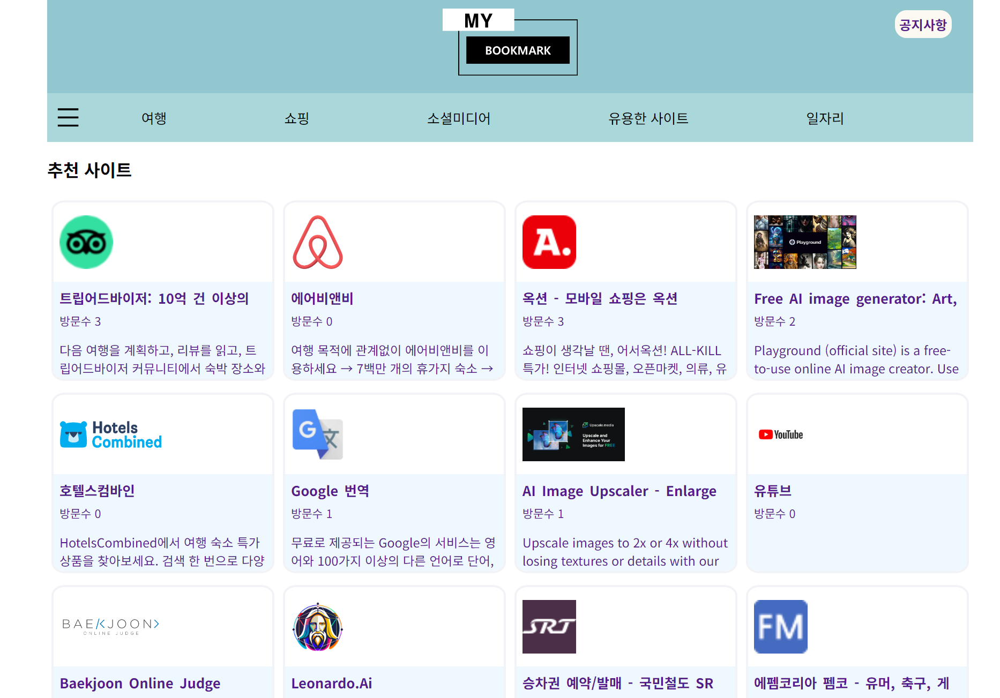
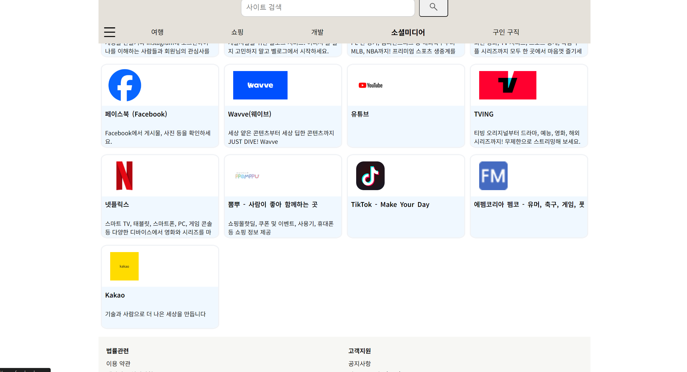

<!-- [Home](..) -->

# 프로젝트
북마크(즐겨찾기) 관리 및 추천 사이트 v2

## 개요
- 기간 : 2024. 06. 06 ~  2024. 08. 13
- 기술 스택 : HTML, CSS, JavaScript, NodeJS, NestJS, MySQL
- 목표 : v1 버전(정적웹사이트)에 백엔드 서버 및 DB 추가
- 요약 : 여러 기기 및 여러 브라우저에서 자유롭게 사용할 수 있는 나만의 북마크 관리용 사이트, 더불어  웹사이트 중 나에게 맞는 카테고리의 사이트를 찾아보고 추천받을 수 있는 사이트
- 프로젝트 실행 방법: 
    - [Backend](./backend-nest-js/)
    - [Front](./project/)      
- 링크 : http://dothomeftp.dothome.co.kr/
- 결과 미리보기  
 

### [Backend](./backend-nest-js/)
    NodeJS, NestJS, TypeScript, Mysql
    
### [Front](./project/)
    HTML, CSS, JavaScript

<!-- ### 환경세팅 -->
### 배포 체크리스트
    각종 브랜치에서 커밋 및 원격 브랜치로 푸쉬
    v2 브랜치에서 변경 내용 병합
    v2 브랜치에서 버전 변경
    v2 브랜치에서 커밋 및 푸쉬
    백엔드 서버 이동
    스크린 혹은 기타(도커)로 접속
    기존 실행중인 서버 정지
    스크린에서 빠져나오기
    서버 파일 경로 접속해서 깃 pull 실행
    새로 빌드
    스크린 접속
    다시 서버 실행
    프론트 서버 ftp 접속
    기존 파일들 삭제
    pages를 제외한 파일들 루트 폴더에 복사
    pages 내부 파일들을 루프 폴더에 복사

### 추가 참고 내용(위 내용 외에 추가로 참고할만한 내용)

