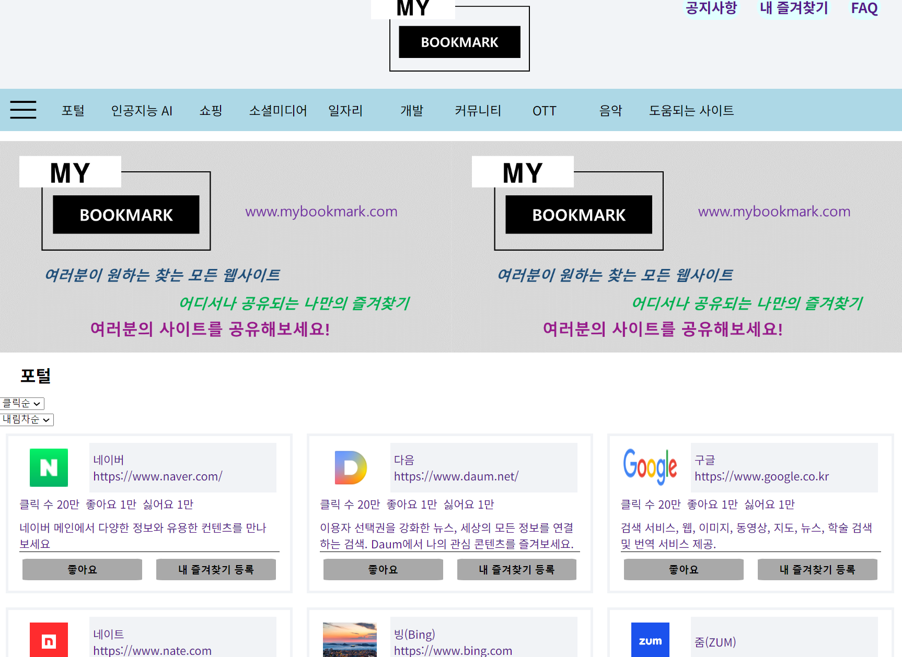
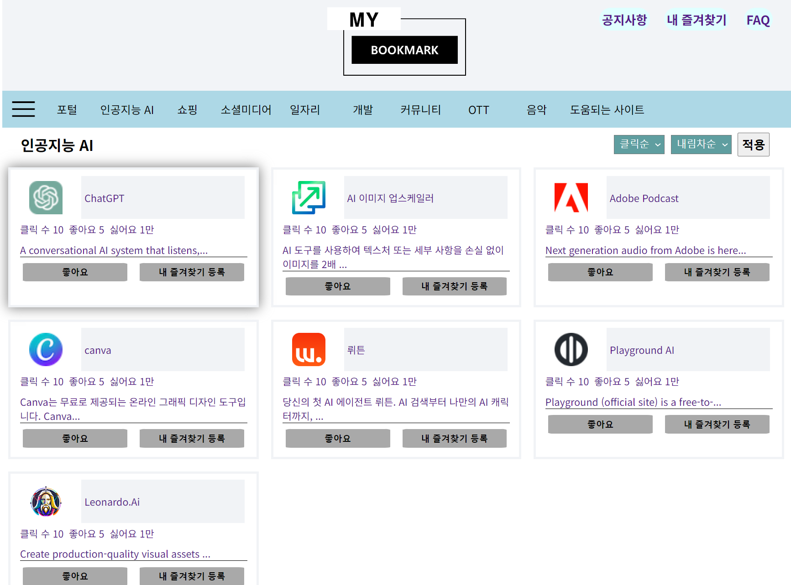

<!-- [Home](..) -->

# 프로젝트
북마크(즐겨찾기) 관리 및 추천 사이트 v1

## 개요
- 기간 : 2024. 04. 05 ~  2024. 05. 31(2개월)
- 기술 스택 : HTML, CSS, JavaScript
- 목표 : 정적 사이트 구축 및 github 무료 호스팅 등록
- 요약 : 여러 기기 및 여러 브라우저에서 자유롭게 사용할 수 있는 나만의 북마크 관리용 사이트, 더불어 너무나도 많은 웹사이트 중 나에게 맞는 카테고리의 사이트를 찾아보고 추천받을 수 있는 사이트
- 프로젝트 실행 방법: VScode에서 index.html파일 라이브 서버 실행 또는 브라우저에서 index.html 파일 열기
- 링크 : https://mygorithm2020.github.io/BookmarkProject/project/pages/index.html
- 결과 미리보기  
 

### 내용
    javascript 기본 사용법 및 문법, HTML 문서의 DOM을 활용한 응용 및 웹 서비스 기초
    url 등록시 html에서 파비콘을 찾거나 root/favicon.ico를 찾거나 둘다 없으면 수작업으로 페이지 메인 로고찾기

#### JS
    localStorage

#### HTML
    실제 코드를 작성하기전에 최소한으로 구조는 잡고 시작한다.
    큰 틀을 잡아놓고 그 세부적인 내용을 계속해서 깊이를 늘려가며 구현
    기본 레이아웃 부터 잡고, 세부적으로 틀을 잡고 구현
    크게 보면
    - <header>
    - <nav>(header나 main 내부로 이동 가능)
    - <main>
    - <footer>
    로 나누고 세부적으로는
    <section>
    <article>
    

    등으로 구분한다.
    

#### CSS
    레이아웃 용 CSS, 위에서부터 큰 틀을 적용하는데 사용하며 가능한 flex안에서 끝낸다.
    - grid
    - flex
    - position
    - float

### 환경세팅

### 추가 참고 내용(위 내용 외에 추가로 참고할만한 내용)

