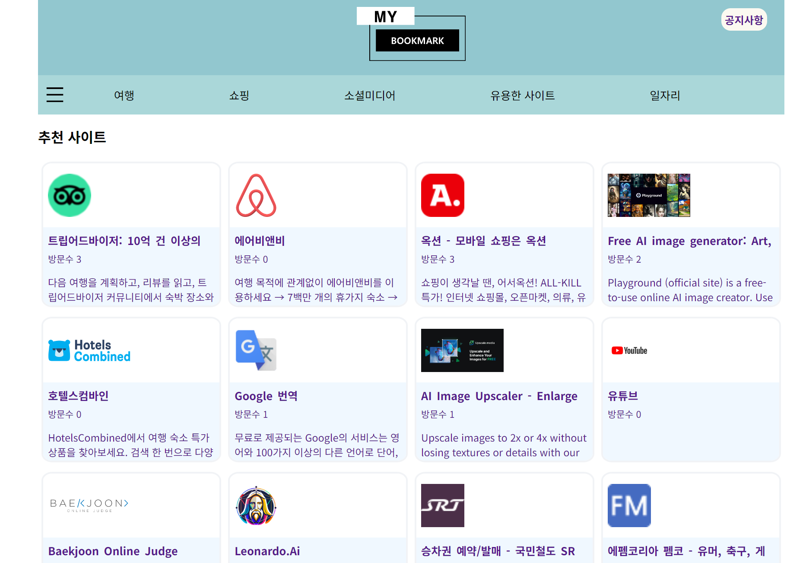
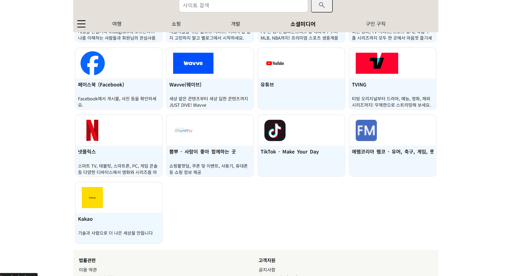

<!-- [Home](..) -->

# 프로젝트
북마크(즐겨찾기) 관리 및 추천 사이트 v2.5.2

## 개요
- 기간 : 2024. 06. 06 ~  2024. 10. 26
- 기술 스택 : HTML, CSS, JavaScript, NodeJS, NestJS, MySQL
- 목표 : v1 버전(정적웹사이트)에 백엔드 서버 및 DB 추가
- 요약 : 여러 기기 및 여러 브라우저에서 자유롭게 사용할 수 있는 나만의 북마크 관리용 사이트, 더불어  웹사이트 중 나에게 맞는 카테고리의 사이트를 찾아보고 추천받을 수 있는 사이트
- 프로젝트 실행 방법: 
    - [Backend](./backend-nest-js/)
    - [Front](./project/)      
- 링크 : http://browseys.site/
- 미리보기  
 

### [Backend](./backend-nest-js/)
    NodeJS, NestJS, TypeScript, Mysql
    
### [Front](./project/)
    HTML, CSS, JavaScript

### Git Commit Message Convention
    Feat : 새로운 기능 추가
    Fix : 버그 수정
    Design : CSS 또는 UI 디자인 변경
    !HOTFIX : 급하게 치명적인 버그 수정
    Style : 코드 포벳 변경, 단순한 코드 정리
    Refactor : 프로덕션 코드 리팩토링
    Comment : 필요한 주석 추가 및 변경
    Docs : 문서(readme etc)변경
    Test : 테스트 코드 수정
    New : 파일, 폴더 등의 추가
    Rename : 파일, 폴더 등의 이름 변경
    Remove : 파일, 폴더 등의 삭제

    실제 사용 주의사항 : 
    - 하나의 커밋에는 최대 2개의 제목만 부여하도록 작업 진행 => 최대한 세분화
    - 변경 사항(기능 추가는 제외)은 한눈에 들어오는 정도로만 하면 best
    - 같은 내용을 한글과 영문으로 작성
    - 무엇을 왜 변경했는지 작성한다
    - 예시
    Feat : 장바구니 기능 / Style : 물건 조회 페이지

    back. 장바구니 기능 추가 요청으로 api 추가
    back. add api for shopping cart func

    front. 물건 조회 페이지내 개발 중에 생성된 불필요한 코드 정리
    front. remove unnecessary code on product list page
    
<!-- ### 환경세팅 -->
### 배포 체크리스트
    각종 브랜치에서 커밋 및 원격 브랜치로 푸쉬
    v2 브랜치에서 변경 내용 병합
    v2 브랜치에서 버전 변경
    v2 브랜치에서 커밋 및 푸쉬
    백엔드 서버 이동
    서버 파일 경로 접속해서 깃 pull 실행
    새로 빌드
    스크린 혹은 기타(도커)로 접속        
    스크린 접속
    다시 서버 실행
    프론트 서버 ftp 접속
    기존 파일들 삭제
    pages를 제외한 파일들 루트 폴더에 복사
    pages 내부 파일들을 루프 폴더에 복사

### github action으로 CI/CD 자동화 추가
    위 배포 내용 스크립트로 자동화

### 추가 참고 내용(위 내용 외에 추가로 참고할만한 내용)

